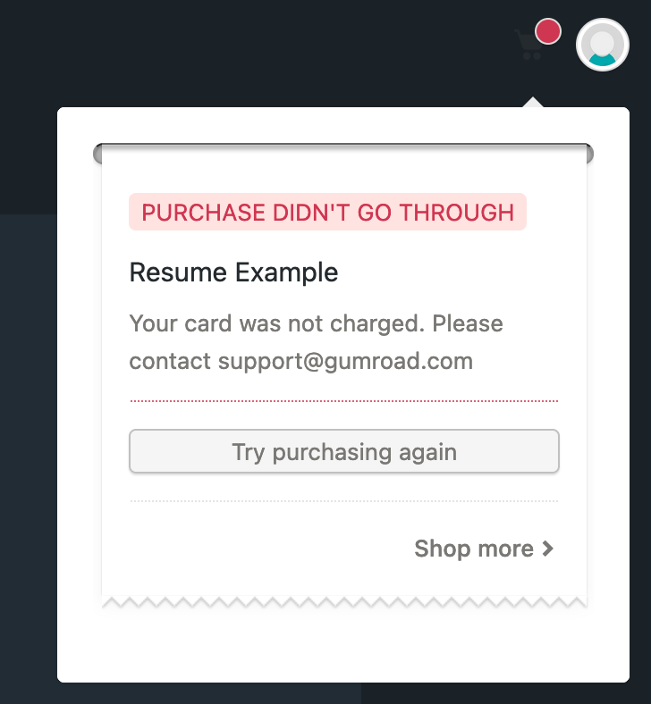

# Testing

- [Ruby Tests](#ruby-tests)
  - [Integration testing](#integration-testing)
  - [Reproduce Buildkite test failures locally](#reproduce-buildkite-test-failures-locally)
  - [Preventing flaky specs in Capybara](#preventing-flaky-specs-in-capybara)
  - [Troubleshooting](#troubleshooting)
- [QA Wolf](#qa-wolf)
- [Previewing emails](#previewing-emails)
- [Custom domains](#custom-domains)
- [Purchases](#purchases)
  - [Stripe](#stripe)
  - [PayPal](#paypal)
  - [Braintree](#braintree)
- [Debugging the overlay and embed widgets](#debugging-the-overlay-and-embed-widgets)
- [Visual testing](#visual-testing)
- [Interacting with local environment](#interacting-with-local-environment)

---

## Ruby Tests

```bash
$ bin/rspec
```

You almost certainly don't want to run the entire test suite locally, that's best left to [CI](https://buildkite.com/gumroad-inc/web), but when wanting to test your local changes, it can be useful to run the tests in a specific file...

```bash
$ bin/rspec spec/requests/dashboard_spec.rb
```

...or a specific test...

```bash
$ bin/rspec spec/requests/dashboard_spec.rb:75
```

### Dependencies

- Run `make local` in a separate shell to spin up required services (e.g. db) through Docker.
- Run `RAILS_ENV=test bin/rails db:setup` to set up the test database.

### Integration testing

We use capybara with selenium (webdriver) for our integration specs.

- We add e2e (also called request) specs for new features.
  - They should cover at least the "happy path".
  - They should also cover errors that are to be expected (invalid inputs, etc).
  - Ideally, they would also cover some edge cases.
- We also add e2e specs when making a change to an existing feature and we discover it doesn't have adequate specs.
- When fixing a bug, it's better to create a failing e2e spec to reproduce it, then work on the fix. The fix should make the spec green.
- We prefer to avoid unnecessary class name selectors in favor of locating elements by:
  - Text content
  - Input label
  - Input placeholder
  - ARIA attributes (might need to be added) for things that do not have a textual representation of their own
  - In case none of the above works, a class name selector might be used. Ideally, not a `js-*` one.
- For clicks, `click_on "Text"` or, if that doesn't work, `find_and_click "selector", text: "Text"`, are preferred.
- We prefer `fill_in "locator", with: "value"` or `find("locator").fill_in(with: "value")` over `x.native.send_keys("...")`.
- If there's an existing test that can be updated, that's preferred over a new test (which takes more lines of code and test suite running time)

#### Google Chrome

For integration specs, we use Chrome and [chromedriver](https://sites.google.com/chromium.org/driver/).

For Linux:

```bash
$ wget -q -O - https://dl-ssl.google.com/linux/linux_signing_key.pub | sudo apt-key add -
$ sudo sh -c 'echo "deb [arch=amd64] http://dl.google.com/linux/chrome/deb/ stable main" >> /etc/apt/sources.list.d/google.list'
$ sudo sudo apt-get update
$ sudo apt-get install google-chrome-stable
```

#### XQuartz

For macOS, you need to install XQuartz to run the request specs.

```bash
$ brew install XQuartz
```

### Reproduce Buildkite test failures locally

<https://github.com/gumroad/web/issues/8410#issuecomment-318496067>

### Preventing flaky specs in Capybara

There are some basic tips you can use to prevent flaky specs in Capybara

- Rely on `expect(page).to have_selector("selector")` as much as possible. This is a smart method in Capybara that handles several situations. Do not use `find` if you can help it. have_selector is your friend!
- Do not use `sleep`, it is hacky and will lead to flakiness.
- Use `wait_for_ajax` if you need to make sure all ajax requests have finished.
- Test new specs multiple times, below is an example of how to run a spec many times locally:

```shell
for i in {1..10}; do
  echo "Run number $i\n-"
  bin/rspec spec/requests/product_creation_spec.rb:28
done
```

### Troubleshooting

#### Failing specs?

_If the spec is new or modified by your PR:_ It likely broke because of your changes. Try to fix it. Ask for help from the reviewer when you assign it for review if you can't fix it.

_If you are sure the failing specs are unrelated to your PR:_ It could be a flaky spec. Confirm the spec passes multiple times locally but not on CI. Let the reviewer know when you assign it for review ([example](https://github.com/gumroad/web/pull/26680#issuecomment-1747253174)).

#### Cannot get chromedriver connection?

If you're running an integration spec and it times out with this error:

```text
Selenium::WebDriver::Error::WebDriverError:
       unable to obtain stable chromedriver connection in 60 seconds (127.0.0.1:7055)
```

#### Rack times out

If you're running an integration spec and it times out with this error:

```text
<Rack::Timeout::RequestTimeoutError: Request ran for longer than 60000ms >
```

You can disable Rack timeout locally. Create a file `.env.test.local` with the following contents:

```text
DISABLE_RACK_TIMEOUT="1"
```

For the new env variables to take effect, you might need to run `bin/spring stop` before running the tests again.

## QA Wolf

[QA Wolf](https://gumroad.slack.com/archives/C03Q53RAMEE) writes and manages automated tests for us. They should be notified when we release new features or change existing ones so they can adjust existing specs and/or write new ones.

## Previewing Emails

You can preview emails locally at [/rails/mailers](https://gumroad.dev/rails/mailers)

## Custom domains

### Setting up a custom domain on staging

Use `domains-staging.gumroad.com` instead of `domains.gumroad.com` in the DNS record.

### Setting up a custom domain on local

1. Add a host entry in `/etc/hosts`

   ```text
   127.0.0.1 sample-custom-domain.example.com
   ```

2. Configure sample-custom-domain.example.com as a custom domain in [gumroad.dev/settings/advanced](https://gumroad.dev/settings/advanced)

3. Remove `Rails.env.development? ||` part from this [line](https://github.com/antiwork/gumroad/blob/main/lib/gumroad_domain_constraint.rb#L5)

4. Restart the server and navigate to http://sample-custom-domain.example.com:3000

That will load the profile page of the creator through the custom domain.

## Purchases

### Stripe

When testing purchases, only use the test credit card numbers listed in [Stripe's documentation](https://stripe.com/docs/testing#cards).

Examples:

- `4242 4242 4242 4242`
- `4000 0000 0000 0077`

### PayPal

We use Braintree as a gateway for PayPal as of writing this wiki.

#### Purchase flow (Buyer) - staging testing

##### Login credentials

- Email: `test@test.com` (any email)
- Password: `password` (any string will work)

### Sandbox Gumroad account

Used for Payouts. No sandbox sales/transactions will show up here as Braintree does not integrate with the PayPal sandbox.

#### Credentials

- Email: `paypal-gr-sandbox@gumroad.com`
- Password: Saved in 1Password

### IPN messages

We currently rely on IPN messages for:

- Chargebacks and reveresed chargebacks
- Payouts completion notification, which also contains the payouts fee information.

#### Viewing IPN messages

- Sandbox: <https://www.sandbox.paypal.com/us/cgi-bin/webscr?cmd=_display-ipns-history>
- Production: <https://www.paypal.com/us/cgi-bin/webscr?cmd=_display-ipns-history>

#### Editing IPN endpoint

- Sandbox: <https://www.sandbox.paypal.com/cgi-bin/customerprofileweb?cmd=_profile-ipn-notify>
- Production: <https://www.paypal.com/cgi-bin/customerprofileweb?cmd=_profile-ipn-notify>

### PayPal setting and other comments

- No operation apart form payouts currently goes through the Gumroad PayPal app itself. We use user credentials w/ their classic API offerings to perform payouts.
- Create and manage new sandbox accounts in the <https://developer.paypal.com> site. Use shared PayPal credentials or get an account created from someone who has payments admin access.

#### PayPal portal and IPN message encoding settings

- At <https://www.paypal.com/cgi-bin/customerprofileweb?cmd=_profile-language-encoding>

### Braintree

Used as a gateway for PayPal transactions. _Only for transaction creation, user vaulting and refunds_

Ask someone who has payments credentials for an account for Braintree in either sandbox or production.

#### Purchase flow (Buyer) - staging testing

- Transactions made locally / staging will show up on Braintree only. Not in PayPal.

## Debugging the overlay and embed widgets

The overlay and embed widgets both rely on iFrames and are best tested by running a host page on a separate web server. [Sinatra](https://www.sinatrarb.com/) is a great tool to get up and running quickly with a web page running on its own server.

Both widgets now detect the Rails application environment automatically -- simply include the script from whichever environment you wish to investigate, e.g. `<script src="https://gumroad.dev/js/gumroad.js"/>`. The code snippets on the `/widgets` page also reflect the current environment.

### Testing locally

There is a simple web app in our repository called [web-overlay-test](https://github.com/antiwork/web-overlay-test). Once you check it out, follow these instructions to test the overlay and/or embed.

- Edit `index.html` to include the permalinks of your products
- Run `ruby web.rb`
- If you run into an error about missing sinatra run `sudo gem install sinatra`
- Visit http://localhost:4567

## Visual testing

We use [QA Wolf](https://app.qawolf.com/gumroad) for visual testing. QA Wolf is enabled by default on `main` branch and is **not** enabled by default on feature branches.

## Interacting with local environment

### Making a new subscription payment

```ruby
# Run this in a rails console
sub = Subscription.last.charge!
sub.charge!
```

Note: If creating multiple subscription purchases in a short time, this method may run afoul of purchase model validations (e.g., `Purchase#not_double_charged`). In these cases you may comment out such validations for testing purposes.

### Making purchases using Stripe Payment Request Button

#### Browser payment

Add a payment method to your browser (Eg: for Chrome, add the Stripe `4242 4242 4242 4242` card in chrome://settings/payments)

#### Apple Pay

1. You need to [set up Apple Pay](https://support.apple.com/en-us/HT204506) with a real card on an iPhone or touch bar Macbook. This card will not be charged on local and staging environments.
2. Add the domain to [Stripe's list of Apple Pay Domains](https://dashboard.stripe.com/settings/payments/apple_pay) if testing on deploy branch. For staging and main, `discover.gumroad.dev`, `creator.gumroad.dev`, `discover.staging.gumroad.com` are already added.

#### Google Pay

Set up wallet on Android phone and access website from mobile Chrome browser.

### Common purchase failures

#### Browser GUID ban

After 3 failed purchase attempts from the same buyer, your browser GUID gets banned. You'll see the following message:



To overcome this:

```ruby
# Run this in a rails console
purchase = Purchase.last
BlockedObject.browser_guid.active.find_by(purchase.browser_guid).destroy
purchase.destroy
```

Making another purchase with a different buyer email should work now.
